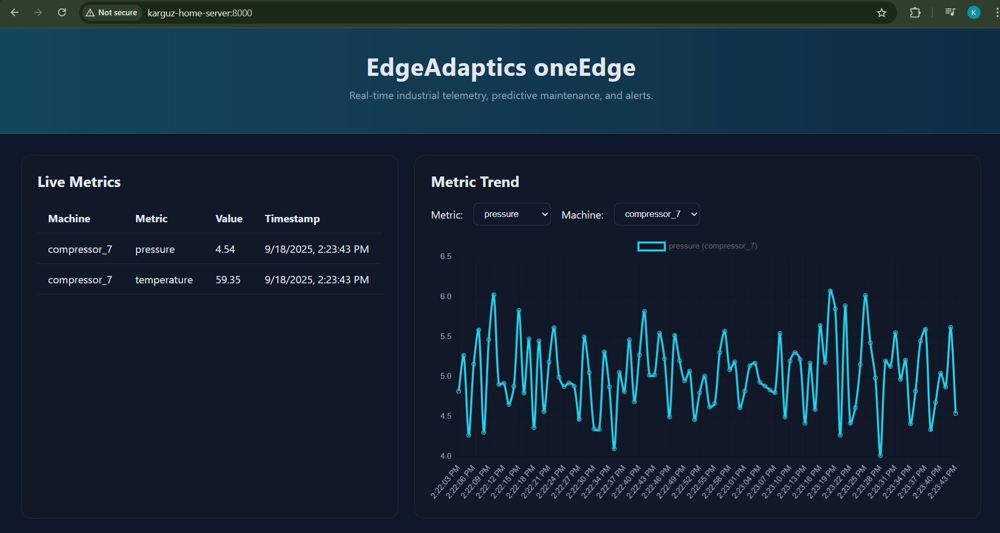

# EdgeAdaptics oneEdge

oneEdge is an industrial edge gateway blueprint that delivers real-time telemetry, on-site analytics, and predictive maintenance for brownfield and greenfield equipment. It reduces dependence on cloud connectivity by running ingestion, event processing, storage, and visualization directly on the plant floor while remaining interoperable with OPC UA, MQTT, and simulated data sources.



## Why oneEdge?

- **Milliseconds latency** – Stream analytics and alerting execute at the edge so machines receive feedback immediately, even when the WAN is congested or offline.
- **Predictive maintenance** – Threshold rules and anomaly detection (z-score) continuously evaluate vibration, temperature, pressure, and other signals to flag emerging failures early.
- **Energy optimisation** – Local processing highlights inefficiencies (idle/overloaded assets) and can trigger corrective actions without cloud round trips.
- **Protocol bridge** – OPC UA clients, MQTT adapters, and simulation pipelines normalise data from legacy PLCs and modern smart sensors into a unified topic taxonomy.
- **Security & sovereignty** – TLS-enabled MQTT, role-protected dashboards, offline-first storage, and IEC 62443-aligned hardening guidance keep operational data on-site while staying audit-ready.
- **Scalable rollout** – Modular microservices (ingestion, analytics, UI) deploy as individual containers or processes. Start with a pilot then scale line-by-line.
- **Zero-trust device onboarding** – The catalogue captures auth method, rotation cadence, allow-listed endpoints, and automatically rotates secrets to enforce zero-trust principles at the edge.

## Solution Overview

```
┌──────────┐   OPC UA / Modbus   ┌────────────────────────┐    MQTT Pub/Sub    ┌────────────────────────┐
│ Machines │ ──────────────────▶ │ Ingestion Service       │ ─────────────────▶ │ Analytics Engine        │
│ PLCs     │                     │  • OPC UA client        │                    │  • Rules & ML hooks     │
└──────────┘                     │  • Simulator publisher  │                    │  • Alert generation      │
                                └─────────┬───────────────┘                    └─────────┬───────────────┘
                                          │                                              │
                                          ▼                                              ▼
                                   Local MQTT Broker                            Time-series Storage (SQLite)
                                          │                                              │
                                          ▼                                              ▼
                                   Dashboard / REST API  ◀────────────────────  Alerts topic (SSE bridge)
                                   • FastAPI backend                        • Push notifications / integrations
                                   • Web UI (Chart.js)                      • Retention maintenance
```

## Repository Layout

```
configs/                # YAML configuration templates and runtime config
docs/                  # Additional documentation & images (dashboard screenshot, feature guides)
services/
  analytics/            # Streaming analytics and alert engine
  common/               # Shared helpers (config loader, MQTT wrapper, logging)
  dashboard/            # FastAPI server and static UI assets
  ingestion/            # OPC UA ingest and sensor simulation
  storage/              # SQLAlchemy models and retention tasks
scripts/                # Entry points for each microservice
tests/                  # Pytest-based unit tests for analytics logic
docker-compose.yml      # Reference deployment for MQTT + services
Dockerfile              # Base image used by the compose stack
requirements.txt        # Runtime dependencies
requirements-dev.txt    # Optional dev/test dependencies (pytest)
```

## Getting Started (Local Python Environment)

1. **Prerequisites**
   - Python 3.11+
   - Local MQTT broker (`eclipse-mosquitto` is included in Docker Compose) or adjust `configs/oneedge.yaml`
   - Optional OPC UA server (e.g. simulators such as *freeopcua*). The built-in simulator can generate telemetry when no PLC is available.

2. **Install dependencies**

   ```bash
   python -m venv .venv
   source .venv/bin/activate
   pip install -r requirements.txt
   pip install -r requirements-dev.txt  # optional for tests
   ```

3. **Configure gateway**
   - Copy `configs/oneedge.example.yaml` to `configs/oneedge.yaml` and adjust:
     - `mqtt`: host, credentials, TLS settings
     - `opcua`: endpoint, node IDs, security certificates (set `enabled: false` to skip)
     - `simulated_sensors`: enable to generate demo data without hardware
     - `analytics.rules`: site-specific thresholds or KPIs
     - `dashboard.basic_auth`: turn on role protection and set credentials

4. **Start services (each terminal)**

   ```bash
   # Terminal 1 – ingestion (OPC UA + simulator)
   python scripts/run_ingestion.py

   # Terminal 2 – analytics + alert engine
   python scripts/run_analytics.py

   # Terminal 3 – FastAPI dashboard (http://localhost:8000)
   python scripts/run_dashboard.py
   ```

   The services share the same configuration file and MQTT broker. Ingestion will publish both PLC (if configured) and synthetic signals to topics such as `oneEdge/machines/compressor_7`.

5. **Run maintenance (optional)**

   ```bash
   python scripts/run_retention.py
   ```

## Containerised Deployment

A ready-to-run compose stack (built from a multi-stage Dockerfile for lean runtime images) is included for rapid evaluation:

```bash
docker compose build --no-cache
docker compose up -d
```

Services launched:

- `mqtt`: Eclipse Mosquitto broker exposing port `1883`
- `ingestion`: OPC UA client + simulator (publishes to `oneEdge/...` topics)
- `analytics`: Rule-based and anomaly detection engine writing to SQLite (`data/oneedge.db`)
- `dashboard`: FastAPI UI on `http://localhost:8000` (Basic Auth optional)
- `retention` (profile `maintenance`): on-demand cleanup job for historical data

Configuration is bind-mounted from `./configs`. The SQLite database is persisted in the `data` volume. Adjust `configs/oneedge.yaml` before launching to match site settings. Mosquitto is shipped in loopback-only mode by default; a starter config is provided at `configs/mosquitto/mosquitto.conf` to open `listener 1883` for the stack—harden this (TLS, auth, ACLs) before production use.

> **Schema updates:** When new columns are introduced (e.g. zero-trust device fields) run `docker compose down -v` to drop the `data` volume so SQLite can rebuild the schema.

### Device Provisioning, Auto-Refresh & Zero-Trust Controls

- The control panel now provides dedicated views for Overview, Devices, Onboarding Monitor, Alerts, and Settings via the navigation bar (with a Devices dropdown).
- The device catalogue form captures authentication method, static device key, rotation interval, hardware fingerprint, metadata, and optional policy templates. Data persists in SQLite and can be manipulated via the REST API—see [device provisioning guide](docs/device-provisioning.md).
- Zero-trust lifecycle actions (challenge issuance, rotate, quarantine, authorize, delete) are exposed both in the UI and via `/api/devices/*` endpoints. The table highlights quarantined, stale, and overdue devices.
- Metrics and devices auto-refresh (5s / 15s cadence respectively) and pause when the browser tab is hidden to conserve resources.
- Alerts stream in real time via Server-Sent Events and can be acknowledged inline without a full page reload.

### Additional Documentation

- [Architecture notes](docs/architecture.md) — high-level view of services and data flow.
- [Device provisioning](docs/device-provisioning.md) — API contract and workflow for managing the asset catalogue.
- [Device onboarding](docs/device-onboarding.md) — end-to-end zero-trust registration flow and lifecycle actions.

### Zero-Trust Onboarding Simulator

Use the helper script to exercise provisioning, challenge/response registration, rotation, and telemetry:

```bash
python scripts/device_onboarding_sim.py pressline-01 --base-url http://localhost:8000 --mqtt-host localhost
```

Add `--skip-provision` to reuse an existing record or `--use-secret-mqtt` to pass the rotated secret as a broker password.

To run periodic retention maintenance:

```bash
docker compose run --rm retention
```

## Dashboard & APIs

- **Web UI** – select machines and metrics for trend charts, view live alert stream, and acknowledge incidents.
- **REST endpoints**
  - `GET /api/metrics/latest` – most recent reading for each metric/topic
  - `GET /api/metrics/history?metric=temperature&topic=oneEdge/machines/...` – historical window
  - `GET /api/alerts` – alert backlog (ack status included)
  - `POST /api/alerts/{id}/ack` – acknowledge alert
  - `GET /api/alerts/stream` – Server-Sent Events channel for live alerts
- **Security** – enable `dashboard.basic_auth.enabled` to require credentials for the UI and API. The MQTT bridge subscribes to the `alerts` topic and relays messages to connected clients with back-pressure handling.

## Analytics Logic

- Sliding window statistics per `{topic}/{metric}` with configurable window length and z-score threshold.
- Rule engine supporting comparison operators (`>`, `>=`, `<`, `<=`, `==`, `!=`) and dwell duration (`duration_s`) before triggering alerts.
- Cooldown (30 s default) prevents alert storms while keeping operators informed.
- Alerts are published back to MQTT on `oneEdge/alerts`, stored in SQLite, and surfaced via the dashboard.
- Extend with ML models by replacing `_detect_zscore` or adding new processors within `AnalyticsEngine.on_message`.

## Storage & Retention

- SQLite/SQLAlchemy persistence stores raw payloads, metrics, alerts, and health snapshots for auditability.
- Configure retention in `storage.retention` (days). Run `scripts/run_retention.py` or the compose maintenance service to purge old data.
- Historical records can be exported via SQL or the REST API for upstream analytics or machine learning.

## Testing

Run the bundled unit tests (requires `pytest`):

```bash
pytest
```

The current suite validates rule-based and z-score alerting behaviour. Add tests covering protocol adapters, database ops, or regression cases as you harden the platform.

## Security Considerations & Next Steps

- **MQTT** – enable TLS by providing broker certificates and setting `mqtt.tls: true` (update username/password). For production, restrict topics per client and enforce ACLs.
- **OPC UA** – populate `opcua.security` with certificate paths and `policy/mode` combinations mandated by the PLC vendor.
- **Dashboard HTTPS** – set `dashboard.tls.enabled: true` and mount certificates (e.g. `./certs:/certs:ro`) to serve the control panel over TLS.
- **Secrets** – never commit plaintext credentials. Instead, load from container secrets or environment variables and reference them via config templating.
- **Hardening** – run services as non-root inside containers, enable firewall rules on the gateway, and follow IEC 62443 segmentation guidelines (separate IT/OT zones, DMZ for remote management).
- **Extensibility** – integrate Modbus/TCP, Sparkplug B payloads, or additional analytics microservices by subscribing to the MQTT bus. Connect the optional `cloud_sync` stanza to forward summarised insights to enterprise systems when WAN links are available.

## Roadmap Ideas

1. Swap the rule-based anomaly detection for a trained model (e.g. autoencoder, ARIMA) stored in the `models/` directory.
2. Add device management APIs (remote firmware updates, config drift detection).
3. Integrate notification channels (email, SMS, Teams/Slack) via the `notifications` config.
4. Wrap services in Kubernetes manifests or edge orchestration frameworks (Balena, K3s) for fleet deployment.
5. Incorporate digital twin visualisations or asset hierarchies aligning with ISA‑95 models.

---
EdgeAdaptics oneEdge demonstrates how edge-native analytics, interoperability, and cybersecurity converge to unlock Industry 4.0 value—without sacrificing existing investments or uptime.
